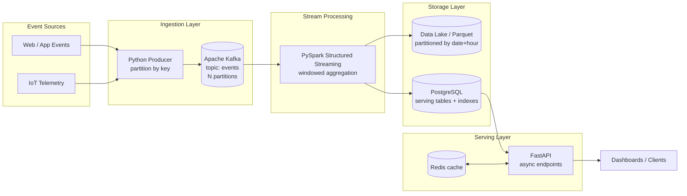
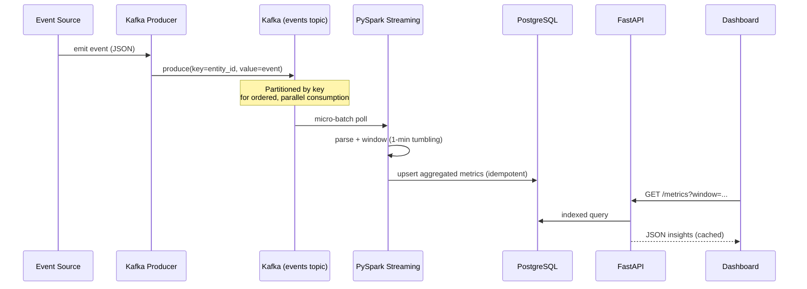
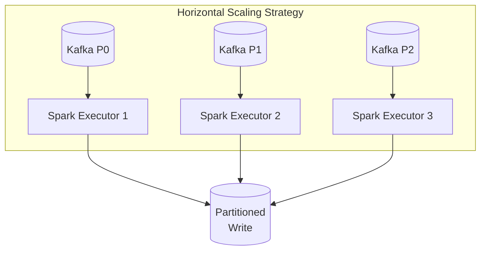

# InsightsStream — Real-Time Data Analytics Platform

> A scalable, end-to-end streaming data platform that ingests high-volume event data through **Apache Kafka**, processes it in real time with **PySpark Structured Streaming**, persists it into a partitioned analytics store, and serves low-latency insights via a **FastAPI** service.

[]()
[]()
[]()
[]()
[]()

---

## Table of Contents
- [Overview](#overview)
- [System Architecture](#system-architecture)
- [Data Flow](#data-flow)
- [Component Design](#component-design)
- [Scalability Considerations](#scalability-considerations)
- [Design Decisions](#design-decisions)
- [Tech Stack](#tech-stack)
- [Local Setup](#local-setup)
- [Repository Structure](#repository-structure)

---

## Overview

InsightsStream simulates a production-grade analytics pipeline handling **1M+ events/day**. It demonstrates the
patterns that separate a hobby project from a real platform: decoupled ingestion, horizontally scalable stream
processing, idempotent writes, partitioned storage, and an API layer with caching.

**Use case:** clickstream / IoT telemetry ingestion → real-time aggregation (per-minute metrics, top-N entities)
→ queryable insights for dashboards.

---

## System Architecture



---

## Data Flow



---

## Component Design

| Component | Responsibility | Key Choice |
|-----------|----------------|------------|
| **Producer** | Emit events, partition by `entity_id` | Keyed partitioning guarantees per-entity ordering |
| **Kafka** | Durable, replayable event log | Decouples producers from consumers; absorbs spikes |
| **PySpark Streaming** | Windowed aggregation, dedup | Checkpointing for exactly-once-ish semantics |
| **PostgreSQL** | Serving store for aggregates | Composite indexes on `(metric, window_start)` |
| **FastAPI** | Async, low-latency read API | Non-blocking I/O; Redis cache for hot queries |

---

## Scalability Considerations



- **Throughput scales with partitions** — add Kafka partitions and Spark executors together; each partition is
  consumed by exactly one executor, so parallelism grows linearly.
- **Backpressure** — Spark `maxOffsetsPerTrigger` caps intake per micro-batch to prevent executor OOM during spikes.
- **Idempotent writes** — aggregates are `UPSERT`ed by `(metric, window_start)` so reprocessing after failure is safe.
- **Storage partitioning** — Parquet partitioned by `date/hour` enables partition pruning and cheap retention drops.
- **Read scaling** — Redis caches hot aggregate queries; PostgreSQL read replicas can be added behind the API.
- **Stateless API** — FastAPI instances scale horizontally behind a load balancer.

---

## Design Decisions

| Decision | Why | Trade-off |
|----------|-----|-----------|
| **Kafka over direct DB writes** | Decouples ingest from processing; replayable; absorbs bursts | Added operational component |
| **Structured Streaming over Kafka Streams** | Reuse Spark/PySpark skill set; unified batch + stream | Higher resource footprint |
| **Tumbling windows** | Simple, deterministic per-minute metrics | Less flexible than session windows |
| **PostgreSQL for serving** | Strong indexing + SQL for ad-hoc queries | Not ideal for >TB; would shard or move to OLAP later |
| **Redis cache** | Sub-ms reads for hot dashboards | Cache invalidation complexity |
| **Docker Compose** | One-command reproducible local stack | Not production orchestration (would use K8s) |

---

## Tech Stack

- **Ingestion:** Apache Kafka, `confluent-kafka` Python producer
- **Processing:** PySpark Structured Streaming
- **Storage:** PostgreSQL, Parquet data lake
- **Serving:** FastAPI (async), Redis
- **Infra:** Docker, Docker Compose
- **Language:** Python 3.11

---

## Local Setup

```bash
# 1. Start the full stack (Kafka, Spark, Postgres, Redis, API)
docker compose up -d

# 2. Start the event producer (simulates 1M+ events/day)
python producer/produce_events.py

# 3. Submit the streaming job
python processing/stream_job.py

# 4. Query insights
curl "http://localhost:8000/metrics?metric=page_views&window=2026-06-28T10:00"
```

---

## Repository Structure

```
insightsstream/
├── README.md                 # this file (architecture + design)
├── docker-compose.yml        # Kafka, Spark, Postgres, Redis, API
├── requirements.txt
├── producer/
│   └── produce_events.py     # keyed Kafka producer
├── processing/
│   └── stream_job.py         # PySpark Structured Streaming aggregation
├── api/
│   └── main.py               # FastAPI serving layer
└── docs/
    ├── architecture.md       # deep-dive architecture notes
    └── scalability.md        # capacity planning + benchmarks
```

---

*Built to demonstrate large-scale data platform design: decoupled ingestion, horizontally scalable processing,
idempotent storage, and a cached serving layer.*
