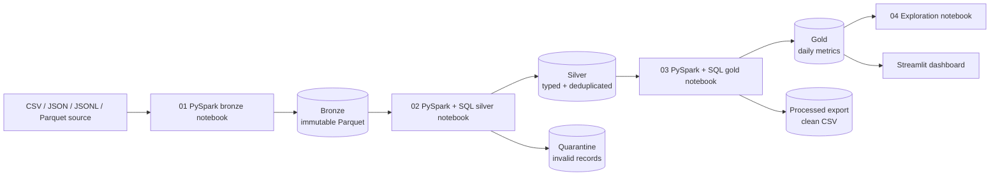
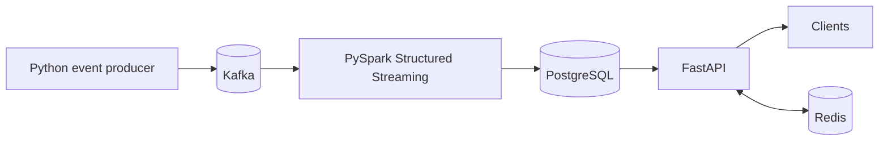

# InsightsStream

InsightsStream is a portfolio-ready data engineering project that demonstrates two complementary data paths:

1. a **PySpark + Spark SQL notebook-driven medallion lakehouse** that ingests source files, stores
   bronze/silver/gold data in local object storage or Cloudflare R2, publishes processed data, and powers a
   Streamlit dashboard;
2. the original **real-time Kafka + PySpark path** for streaming events into PostgreSQL and FastAPI.

The local lakehouse path is the default, so the full demonstration works without an account, credit card, or
cloud credentials. Cloudflare R2 uses the same code through its S3-compatible API.

## Lakehouse architecture



Each object is stored under a visible, auditable prefix:

```text
bronze/events/ingestion_date=YYYY-MM-DD/batch_id=<id>/events.parquet
silver/events/batch_id=<id>/events_clean.parquet
quarantine/events/batch_id=<id>/rejected.parquet
gold/daily_metrics/batch_id=<id>/daily_metrics.parquet
processed/batch_id=<id>/events_processed.csv
metadata/runs/<id>.json
metadata/latest.json
```

## What the pipeline demonstrates

| Stage | Behavior |
|---|---|
| Source | Accepts CSV, JSON, JSONL/NDJSON, or Parquet with `entity_id`, `metric`, `value`, and `ts` |
| Bronze | Preserves source fields and adds batch, source, and ingestion metadata |
| Silver | Standardizes fields, parses UTC timestamps and numbers, deduplicates events, and derives date/hour |
| Quarantine | Separates invalid required fields instead of silently discarding them |
| Gold | Produces daily event count, total value, unique entities, and average value by metric |
| Processed | Delivers cleaned event-level data as CSV for a downstream system |
| Metadata | Records row counts, object locations, timestamps, and latest-run state |
| Dashboard | Reads the latest gold object from the same configured storage backend |

## Quick start: free local demo

Python 3.11 is recommended.

```powershell
python -m venv .venv
.\.venv\Scripts\Activate.ps1
python -m pip install -r requirements.txt

# Run all medallion stages against the included source.
python -m insightsstream.cli data\source\sample_events.csv

# Inspect the dashboard.
streamlit run dashboard\app.py

# Or open and run notebooks 01 through 04 in order.
jupyter lab
```

The generated lake is under `data/lakehouse/` and is intentionally ignored by Git.
PySpark is the default CLI engine. A lightweight compatibility run is also available with `--engine pandas`.

## Use your own source

Provide a CSV, JSON, JSONL, or Parquet file containing:

| Column | Meaning | Example |
|---|---|---|
| `entity_id` | User, device, or business entity | `user_001` |
| `metric` | Event or measure name | `page_views` |
| `value` | Numeric measure | `1` or `49.99` |
| `ts` | ISO-8601 event timestamp | `2026-09-27T10:00:00Z` |

Then run:

```powershell
python -m insightsstream.cli C:\path\to\your_events.csv
```

Column names are trimmed and lowercased. Invalid required values are written to quarantine, and repeated events
with the same entity, metric, and timestamp are deduplicated in silver.

## Free hosted storage: Cloudflare R2

R2 is useful for a portfolio demo because it has an S3-compatible API and a web dashboard where the medallion
prefixes and output objects can be inspected. Check Cloudflare's current pricing page before use because free-tier
terms can change.

1. Create an R2 bucket named `insightsstream` in the Cloudflare dashboard.
2. Create an R2 API token with **Object Read & Write** access limited to that bucket.
3. Copy `.env.example` to `.env`, but do not commit `.env`.
4. Fill in the R2 values and change `INSIGHTS_STORAGE_BACKEND` to `r2`.
5. Run the pipeline:

```powershell
python -m insightsstream.cli data\source\sample_events.csv
streamlit run dashboard\app.py
```

The notebooks and dashboard automatically use R2 when these variables are present. A successful pipeline run will
show the `bronze/`, `silver/`, `gold/`, `quarantine/`, `processed/`, and `metadata/` prefixes in the R2 web console.
The repository does not connect to your R2 account until you provide these credentials locally. Credentials are
never stored inside a notebook or source file.

## Notebook walkthrough

The optional Kafka notebook and the four medallion notebooks contain PySpark DataFrame operations and executable
Spark SQL queries; they do not use Pandas.

1. `notebooks/00_kafka_to_bronze.ipynb` — optionally consume Kafka micro-batches with Structured Streaming.
2. `notebooks/01_bronze_ingestion.ipynb` — show/profile a file source with Spark SQL and land the raw batch.
3. `notebooks/02_bronze_to_silver.ipynb` — clean, validate, deduplicate, and quarantine with Spark SQL.
4. `notebooks/03_silver_to_gold.ipynb` — aggregate with Spark SQL and publish processed event data.
5. `notebooks/04_gold_exploration.ipynb` — run KPI and ranking SQL over the latest gold dataset.

Business logic lives in `insightsstream/spark_pipeline.py` rather than being duplicated across cells. This makes
the notebooks easy to explain while keeping the PySpark pipeline testable and usable from an orchestrator or CI
job. The Pandas implementation remains as a lightweight fallback for machines without Java.

## Real-time streaming path

The original streaming prototype remains available:



```powershell
docker compose up -d
python producer\produce_events.py
python processing\stream_job.py
```

See `docs/architecture.md` for how the batch and stream paths fit together.

## Test

```powershell
python -m pytest tests
```

## Repository structure

```text
InsightsStream/
├── insightsstream/          # PySpark pipeline, fallback pipeline, and storage adapters
├── notebooks/               # Kafka, bronze, silver, gold, and SQL notebooks
├── dashboard/app.py         # Streamlit dashboard
├── data/source/             # committed example input only
├── tests/                   # pipeline tests
├── producer/                # Kafka event producer
├── processing/              # PySpark streaming job
├── api/                     # FastAPI serving API
├── infra/                   # PostgreSQL initialization
├── docs/                    # architecture and scalability details
├── .env.example             # local/R2 configuration template
└── requirements.txt
```
