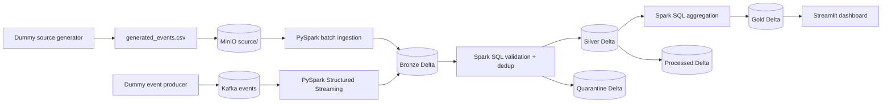

# InsightsStream

InsightsStream is a fully local data-engineering demonstration built around:

- **batch ingestion** from a generated CSV source;
- **continuous ingestion** from Kafka;
- **PySpark and Spark SQL** transformations;
- **real Delta Lake tables** with transaction logs;
- **MinIO** as a local S3-compatible object store;
- **Jupyter notebooks** for each pipeline stage;
- a **Streamlit dashboard** over the gold Delta table.

No cloud account or payment method is required.

## Architecture



Both source types converge in `bronze/events`. The `source_type` column identifies `batch` versus `stream`
records. Every Delta table contains a `_delta_log/` prefix, proving that it is Delta rather than a folder of plain
Parquet files.

## One-command local demo

Requirements:

- Docker Desktop
- PowerShell

Run:

```powershell
Set-Location "C:\Users\habba\OneDrive\Desktop\InsightsStream"
.\scripts\start-local-demo.ps1 -Rows 1000
```

This command:

1. starts Kafka, MinIO, Jupyter, and Streamlit in Docker;
2. generates `data/source/generated_events.csv`;
3. uploads the source CSV to MinIO;
4. appends the batch to the bronze Delta table;
5. builds silver and quarantine Delta tables;
6. builds gold and processed Delta tables.

Open:

| UI | URL | Credentials |
|---|---|---|
| MinIO object browser | http://localhost:9001 | `insights` / `insights-local` |
| Jupyter Lab | http://localhost:8888 | No token |
| Streamlit dashboard | http://localhost:8501 | None |

The credentials are intentionally local development credentials and must not be reused outside this Docker stack.
The MinIO, Jupyter, dashboard, and host Kafka ports are bound to `127.0.0.1`, so the no-token development UIs are
not exposed to other machines on the network.

## What to show an interviewer

### 1. Source

The generator is `producer/generate_source.py`.

The generated source is visible in two places:

```text
Windows:
data/source/generated_events.csv

MinIO:
insightsstream/source/generated_events.csv
```

### 2. Raw Delta data

Open the `insightsstream` bucket in MinIO and navigate to:

```text
bronze/events/
├── _delta_log/
└── ingestion_date=YYYY-MM-DD/
    └── part-....snappy.parquet
```

`_delta_log` contains the ACID transaction history. Bronze contains unchanged event values plus ingestion,
source, batch, and Kafka-offset metadata.

### 3. Clean and rejected data

```text
silver/events/       # typed, standardized, deduplicated records
quarantine/events/   # invalid records with rejection reason
```

### 4. Aggregated and delivered data

```text
gold/daily_metrics/  # dashboard-ready metrics
processed/events/    # clean event-level downstream Delta table
```

### 5. Inspect the layout from a terminal

```powershell
docker compose exec -T notebook python -m insightsstream.inspect_lake
```

## Batch versus continuous ingestion

### Batch

The one-command demo runs the batch path. To generate a different volume:

```powershell
.\scripts\start-local-demo.ps1 `
  -Rows 10000 `
  -Days 30 `
  -InvalidRate 0.01 `
  -DuplicateRate 0.02 `
  -Seed 42
```

The batch generator deliberately supports invalid and duplicate events so the silver and quarantine behavior is
visible.

### Continuous Kafka

After the stack is running, generate Kafka events for 15 seconds:

```powershell
python producer\produce_events.py --events-per-second 25 --duration 15
```

Then open `notebooks/00_kafka_to_bronze.ipynb` in Jupyter and run all cells. The available Kafka offsets are
appended to the same bronze Delta table with:

```text
source_type = stream
kafka_topic
kafka_partition
kafka_offset
```

After adding streaming records, rerun notebooks 02 and 03 to refresh silver, quarantine, gold, and processed
tables.

## Notebook walkthrough

Run in this order:

1. `notebooks/01_bronze_ingestion.ipynb` — generate/upload CSV and append batch data to bronze Delta.
2. `notebooks/00_kafka_to_bronze.ipynb` — optionally append Kafka events with Structured Streaming.
3. `notebooks/02_bronze_to_silver.ipynb` — validate and deduplicate with Spark SQL.
4. `notebooks/03_silver_to_gold.ipynb` — create gold and processed Delta tables.
5. `notebooks/04_gold_exploration.ipynb` — query KPIs and display Delta transaction histories.

All ETL notebook operations use PySpark or Spark SQL. Pandas is used only by Streamlit to render the small gold
result in a browser.

## Generated object layout

```text
insightsstream/
├── source/
│   └── generated_events.csv
├── bronze/events/
│   ├── _delta_log/
│   └── ingestion_date=.../
├── silver/events/
│   ├── _delta_log/
│   └── event_date=.../
├── quarantine/events/
│   └── _delta_log/
├── gold/daily_metrics/
│   └── _delta_log/
├── processed/events/
│   ├── _delta_log/
│   └── event_date=.../
├── checkpoints/kafka-to-bronze/
└── metadata/latest.json
```

## Stop or reset

Stop containers while retaining MinIO data:

```powershell
docker compose down
```

The next `start-local-demo.ps1` run resets project objects by default and creates a clean demonstration. To append
another batch instead:

```powershell
docker compose exec -T notebook python -m insightsstream.delta_demo --rows 1000 --keep-existing
```

Remove containers and the MinIO volume:

```powershell
docker compose down -v
```

## Tests

```powershell
python -m pytest tests
docker compose config
```

## Main project files

```text
docker-compose.yml                   # Kafka, MinIO, Jupyter, dashboard
scripts/start-local-demo.ps1         # one-command interviewer demo
producer/generate_source.py          # batch dummy-data generator
producer/produce_events.py           # continuous Kafka producer
insightsstream/delta_pipeline.py     # batch + streaming Delta logic
insightsstream/delta_demo.py         # generated source to complete lakehouse
insightsstream/inspect_lake.py        # visible object-layout report
notebooks/                            # PySpark and Spark SQL walkthrough
dashboard/delta_app.py               # gold Delta dashboard
```
