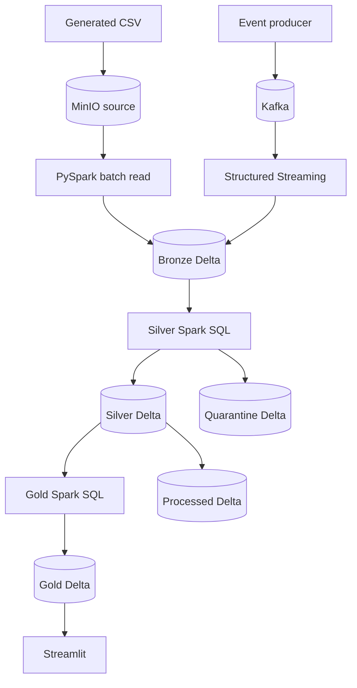

# Architecture Deep Dive

## Unified local lakehouse

InsightsStream runs entirely on a developer machine with Docker:

| Component | Role |
|---|---|
| Kafka | Replayable continuous event source |
| MinIO | Local S3-compatible source and Delta object storage |
| Jupyter | Interactive PySpark and Spark SQL execution |
| Delta Lake | ACID transaction log, schema enforcement, batch/stream unification |
| Streamlit | Dashboard over the gold Delta table |

The design intentionally gives batch and streaming events the same bronze schema.

## Source contract

Both sources produce:

| Field | Type in bronze | Meaning |
|---|---|---|
| `entity_id` | string | User, device, or business entity |
| `metric` | string | Event type or measure |
| `value` | string | Raw measure, typed in silver |
| `ts` | string | Raw event time, typed in silver |

Bronze adds `ingested_at`, `ingestion_date`, `source_type`, `source_name`, and `batch_id`. Streaming rows also
contain Kafka topic, partition, and offset, which provide replay and traceability.

## Delta layers

### Source

The generated CSV remains visible on Windows and is uploaded under `source/` in MinIO. This separates source
delivery from lake ingestion and makes the pull step explicit.

### Bronze

`bronze/events` is append-only. Batch and streaming writes create Delta commits under `bronze/events/_delta_log`.
Raw values are retained so silver rules can change without regenerating source data.

### Silver and quarantine

Spark SQL:

- trims identifiers;
- lowercases metric names;
- casts values to double;
- parses timestamps in UTC;
- derives event date and hour;
- deduplicates by entity, metric, and event timestamp.

Invalid required values are written to `quarantine/events`. Valid records are partitioned by event date in
`silver/events`.

### Gold

`gold/daily_metrics` contains event counts, total values, unique entities, and average values grouped by event date
and metric.

### Processed

`processed/events` is a Delta delivery table containing the clean event-level records. It represents the
post-processing handoff to another application, model, or data warehouse.

## Batch behavior

The batch demo generates a CSV, uploads it to MinIO, and appends it to bronze. Silver, quarantine, gold, and
processed are rebuilt from the complete bronze snapshot. `--keep-existing` demonstrates repeated batch ingestion;
the default clean demo removes previous project objects first.

## Streaming behavior

Structured Streaming reads Kafka and appends directly to the same bronze Delta path. Its checkpoint is stored in
MinIO under `checkpoints/kafka-to-bronze`, so offsets survive notebook restarts. Kafka metadata is retained in
bronze for auditability.

The notebook uses an `availableNow` trigger for an interview-friendly bounded run: produce events for a fixed
duration, stop the producer, then drain all available offsets. The same function also supports a ten-second
continuous processing trigger.

## Why MinIO

MinIO keeps the project free and local while preserving the object-store layout used by S3-compatible platforms.
Its browser UI makes source files, Parquet data files, partitions, checkpoints, and Delta transaction logs easy to
show during an interview.

## Production extensions

1. Replace MinIO endpoints and credentials with managed object storage.
2. Run Spark on a cluster rather than the single local Jupyter container.
3. Use a metastore/catalog for named Delta tables and governance.
4. Schedule silver/gold refreshes or make them continuous streaming tables.
5. Add expectations and alerts for quarantine thresholds.
6. Compact small files and configure retention/VACUUM policies.
