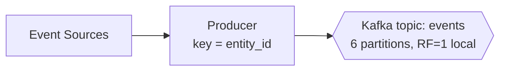
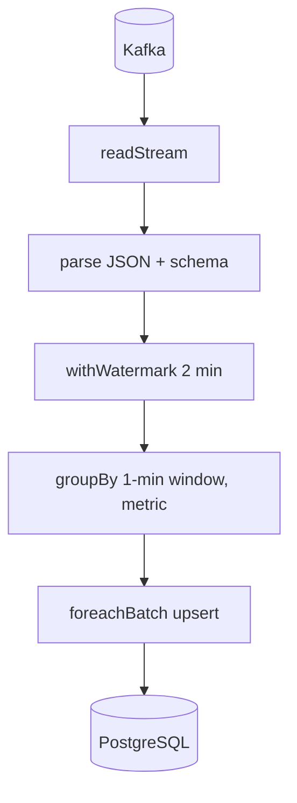
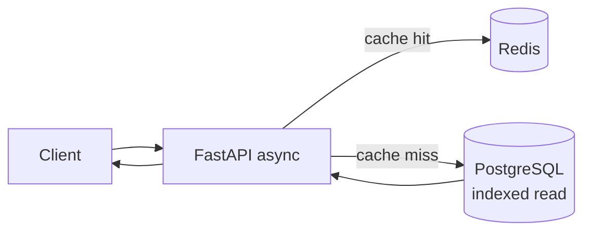

# Architecture Deep-Dive

This document expands on the design of InsightsStream beyond the README overview.

## 1. Ingestion Layer

**Why Kafka?** It decouples producers from consumers and acts as a durable, replayable buffer. If the
processing layer goes down, events accumulate in Kafka rather than being lost, and Spark resumes from its
last committed offset on restart.

**Partitioning strategy:** events are keyed by `entity_id`. This guarantees that all events for a given
entity land on the same partition (preserving order) while spreading load evenly across partitions.

## 2. Processing Layer

- **Watermarking** (`2 minutes`) bounds state so late events are still counted but state doesn't grow forever.
- **Tumbling 1-minute windows** produce deterministic per-minute aggregates.
- **`foreachBatch` + UPSERT** makes writes idempotent: replays after failure overwrite rather than duplicate.
- **Checkpointing** persists offsets and state for exactly-once-style recovery.

## 3. Serving Layer

The API is stateless and async. Reads hit Redis first; on a miss it runs an indexed PostgreSQL query and
backfills the cache with a short TTL. Stateless design means API replicas scale horizontally behind a load
balancer.

## Failure Modes & Handling

| Failure | Behavior |
|---------|----------|
| Producer crash | Kafka retains prior events; resume on restart |
| Spark crash | Restarts from checkpointed offsets; idempotent upserts prevent dupes |
| Postgres slow | Redis absorbs hot reads; backpressure caps Spark intake |
| Traffic spike | Kafka buffers; `maxOffsetsPerTrigger` smooths processing |
