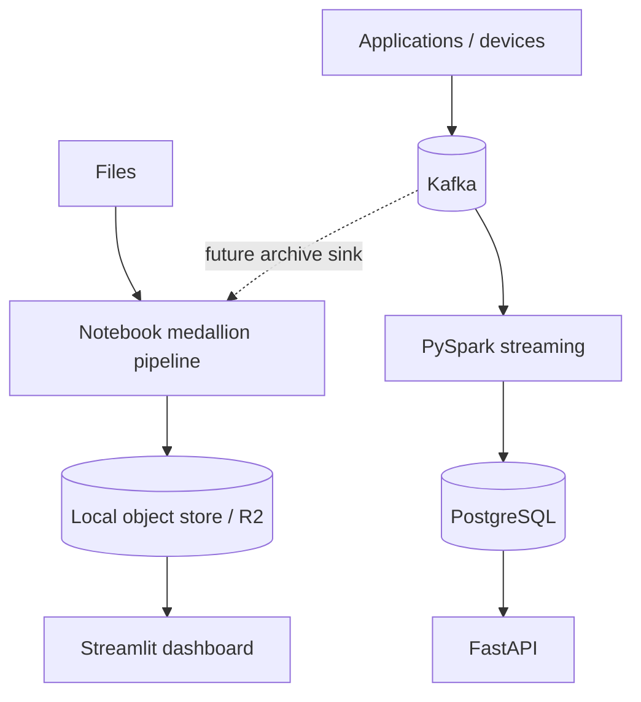
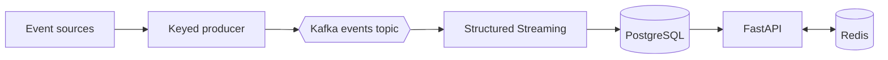

# Architecture Deep Dive

## 1. Two processing paths

InsightsStream uses one event model across two paths:

- The **batch lakehouse path** is the primary portfolio demonstration. It uses PySpark DataFrames and Spark SQL,
  is notebook-driven, inspectable in object storage, and feeds a visual dashboard.
- The **streaming path** demonstrates Kafka buffering, Structured Streaming windows, and low-latency API serving.

In a production design, Kafka events can also be archived to the bronze prefix so both paths converge on one
governed lake.

## 2. Medallion pipeline

### Bronze

Bronze is append-only and batch-addressable. The pipeline validates only that the four contract columns exist,
then retains their values and adds:

- `batch_id`
- `source_file`
- `ingested_at`

Parquet preserves types efficiently and gives the later PySpark stages column pruning and compression.

### Silver and quarantine

Silver applies the data contract through Spark SQL:

- identifiers and metric names are trimmed;
- metric names are lowercased;
- values are converted to numeric;
- timestamps are converted to UTC;
- duplicate `(entity_id, metric, event_ts)` records are removed;
- `event_date` and `event_hour` are derived.

Rows that cannot satisfy required fields are written under `quarantine/`. The run manifest records accepted and
rejected counts, making data quality visible instead of silently hiding failures.

### Gold and processed output

Gold uses Spark SQL to aggregate by event date and metric:

- event count;
- total value;
- unique entities;
- average value.

The gold Parquet object feeds notebook exploration and Streamlit. A cleaned event-level CSV is separately written
under `processed/` as the downstream delivery artifact requested by consumers.

### Run metadata

Every batch has `metadata/runs/<batch_id>.json`. `metadata/latest.json` points notebooks and the dashboard at the
current batch without embedding storage paths in UI code.

## 3. Storage abstraction

The pipeline depends on four object-store operations: put, get, exists, and list. Implementations are:

| Backend | Purpose | Selection |
|---|---|---|
| Local filesystem | Free development, tests, offline presentation | `INSIGHTS_STORAGE_BACKEND=local` |
| Cloudflare R2 | Hosted, web-visible portfolio demonstration | `INSIGHTS_STORAGE_BACKEND=r2` |

R2 uses `boto3` against Cloudflare's S3-compatible endpoint. PySpark writes Parquet/CSV stage files and the object
adapter transfers those files to R2, avoiding cloud credentials in notebooks. The adapter can later support AWS
S3 by changing endpoint and credential configuration without changing transformations.

## 4. Idempotency and replay

A generated batch ID makes normal runs append-only. An orchestrator can pass a stable `--batch-id`; rerunning it
replaces the same object keys rather than creating ambiguous duplicates. Bronze remains available, so silver and
gold can be rebuilt independently through notebooks.

## 5. Streaming path

Events are keyed by `entity_id` for per-entity ordering. Spark uses a two-minute watermark and one-minute tumbling
windows. Kafka offsets and Spark checkpoints support recovery. The existing PostgreSQL/Redis/FastAPI path is kept
separate from the batch dashboard so the zero-cost lakehouse demo has no infrastructure dependency.

## 6. Production extensions

The next scale-up steps would be:

1. use Airflow, Dagster, or a managed scheduler to invoke the same stage functions;
2. add a Kafka-to-bronze archive sink;
3. use Apache Iceberg or Delta Lake for ACID tables and schema evolution;
4. add a catalog, lineage, and data-quality alerting;
5. compact small files and apply lifecycle policies;
6. serve cumulative gold tables instead of only the latest demonstration batch.
