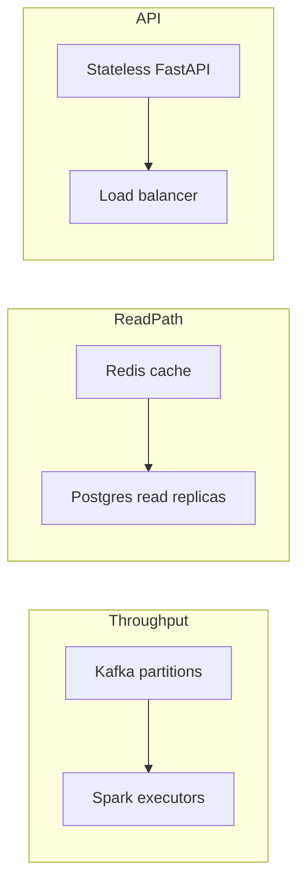

# Scalability & Capacity Planning

## Target

- **1M+ events/day** sustained (~12 events/s average, ~50–100/s peak).
- Headroom to scale to **100M+ events/day** by adding partitions and executors.

## Scaling Levers

| Dimension | Lever | Notes |
|-----------|-------|-------|
| Ingest throughput | Add Kafka partitions | One partition = one parallel consumer slot |
| Processing throughput | Add Spark executors | Match executor count to partition count |
| Spike absorption | Kafka retention buffer | Decouples ingest rate from processing rate |
| Read throughput | Redis + read replicas | Hot aggregates served from cache |
| API capacity | Stateless horizontal scaling | Replicas behind a load balancer |

## Capacity Math (worked example)

- Each Spark executor comfortably handles ~5k events/s in this aggregation.
- To reach 100M events/day (~1,160 events/s avg, assume 5k/s peak):
  - **Partitions needed:** ceil(5,000 / 5,000) = 1 for average, provision **6–12** for peak + ordering headroom.
  - **Executors:** match partition count (e.g., 6 executors of 2 cores each).
- PostgreSQL stores only **aggregates** (per metric per minute), so row growth is
  `metrics × 1,440 minutes/day` — tiny and index-friendly regardless of raw event volume.

## Bottleneck Analysis

1. **Kafka** — rarely the bottleneck; scales with partitions and brokers.
2. **Spark shuffle** — tuned via `spark.sql.shuffle.partitions`; watermark bounds state size.
3. **Postgres writes** — minimized by pre-aggregating in Spark (only minute-level rows are written).
4. **API reads** — Redis cache + composite index keep p99 low.

## Retention & Cost

- Raw events: short Kafka retention (e.g., 7 days) for replay; archived to Parquet (partitioned by `date/hour`)
  for cheap long-term storage and partition pruning.
- Aggregates: retained in PostgreSQL; old partitions dropped cheaply.
